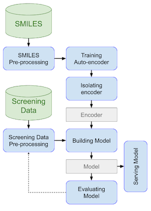
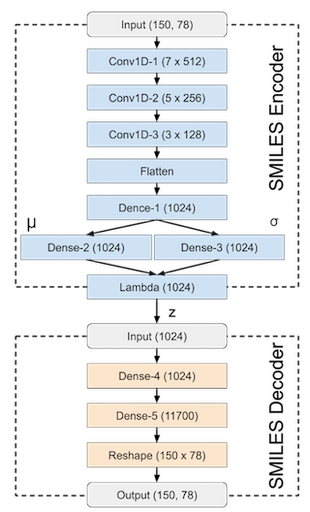
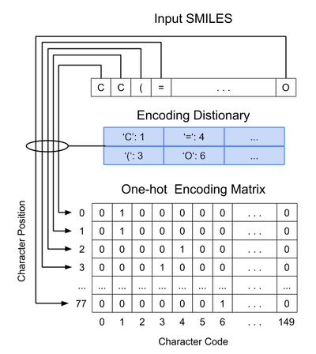
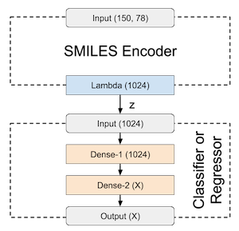

**ArmChem** tool has been released by [AUROMIND Ltd.](https://www.auromind.org) under MIT License. It allows training [Deep Learning](https://en.wikipedia.org/wiki/Deep_learning) models for predicting properties of chemical compounds defined by [SMILES](https://en.wikipedia.org/wiki/Simplified_molecular-input_line-entry_system).


# Background

**ArmChem** uses the following workflow to build classification and regression models for predicting properties of chemical compounds:



It starts with training a variational autoencoder based on the specified collection of chemical compounds. Then isolated  encoder layers are combined with additional sub-network for performing classification or regression tasks (depending on the solving problem). The constructed regression or classification neural networks are trained using screening data. It is important to mention that the encoder layers remain frozen throughout this training. 

## Autoencoder

The [Variational Autoencoder](https://en.wikipedia.org/wiki/Autoencoder) was implemented using a [Convolution Neural Network](https://en.wikipedia.org/wiki/Convolutional_neural_network) in combination with a few layers for supporting the variational training process. Its neural network topology is presented below:



It consists of two joined neural networks: encoder and decoder. The encoder neural network consists of nine layers. The Input layer takes SMILES transformed to the [one-hot](https://en.wikipedia.org/wiki/One-hot) 150x78 matrix representation (each row represents a SMILES character and column its encoding). A visualization of SMILES transformation is shown below:



The input SMILES is less than 150 characters, the original sequence is padded with empty spaces on the right. When the input sequence is adjusted, the transformation process creates a zero-matrix with 150 rows (equals to the maximum number of characters in the input sequence) and 78 columns (equals to SMILES vocabulary size). A transformation loop selects each character in the padded sequence and uses a dictionary to identify the character code. A position of the selected character and its code are used to set the relevant element to 1 in the one-hot matrix.

The input layer is followed by three 1D-convolution layers (_Conv1D-1_, _Conv1D-2_, and _Conv1D-3_) with _512_, _256_, _128_ filters and _7_, _5_, _3_ kernel sizes accordingly. These convolution layers perform a very similar role as 2D-convolution layers in the image processing. They identify specific patterns of elements (atom and bonds) in chemical compounds and aggregate them in bigger substructures at each consequent layer.

The next Flatten layer vectorizes convolution weights, so they can be processed by the following _Dense-1_ layer. This layer has _1024_ neurons, which is the same size as an output latent vector _z_. The size of this layer has been defined via
a hyper-parameters tuning procedure. _Dense-2_ and _Dense-3_ layers implement variational learning, which computes  and  accordingly. The final _Lambda_ layer combines &mu; and &sigma; into a single latent vector (consisting of _1024_ real values. Effectively this latent vector represents a chemical compound fingerprint.

The decoder consists of five layers. The input layer receives the latent vector from the encoder and passes it via two dense layers: _Dense-4_ and _Dense-5_. The _Dense-5_ scale-up original dimensionality from _1024_ to _11700_. This step is needed to transform 1D into 2D vector, which is performed by the _Reshape_ layer. This layer passes 2D vector straight to the output. The final output of all these layers is 150x78 matrix, which can be reversed to the SMILES sequence.

## Regressor & Classifier

Neural network topology of classification and regression models constructed based on the pre-trained encoder is shown below:



The encoder in classification and regression models has the same topology structure as already described in variational autoencoder. However, the attached layers are designed to perform classification or regression task. The _Dense-1_ layer receives chemical compounds fingerprints passes it to the next layer _Dense-2_. There no difference in the current neural network topology whether it's applied for classification or regression problem. The only difference is in an activation function for the _Dense-2_ layer (_relu_ for regression problem and _softmax_ for classification problem) and output dimensionality _X_ which has to be adjusted ( _1_ for regression problem and _number of classes_ for classification problem).


# Data Format

**ArmChem** only works with [CSV data format](https://en.wikipedia.org/wiki/Comma-separated_values). For training an autoencoder, a data set must contain only one column which represents SMILES. For training a regression or classification model, a data set must contain two columns, where the first one represents SMILES and the second the target value as shown in the example below:

```text
Cn1c(CN2CCN(CC2)c3ccc(Cl)cc3)nc4ccccc14,3.54
COc1cc(OC)c(cc1NC(=O)CSCC(=O)O)S(=O)(=O)N2C(C)CCc3ccccc23,-1.18
COC(=O)[C@@H](N1CCc2sccc2C1)c3ccccc3Cl,3.69
OC[C@H](O)CN1C(=O)C(Cc2ccccc12)NC(=O)c3cc4cc(Cl)sc4[nH]3,3.37
Cc1cccc(C[C@H](NC(=O)c2cc(nn2C)C(C)(C)C)C(=O)NCC#N)c1,3.1
OC1(CN2CCC1CC2)C#Cc3ccc(cc3)c4ccccc4,3.14
COc1cc(OC)c(cc1NC(=O)CCC(=O)O)S(=O)(=O)NCc2ccccc2N3CCCCC3,-0.72
CNc1cccc(CCOc2ccc(C[C@H](NC(=O)c3c(Cl)cccc3Cl)C(=O)O)cc2C)n1,0.34
COc1ccc(cc1)C2=COc3cc(OC)cc(OC)c3C2=O,3.05
Oc1ncnc2scc(c3ccsc3)c12,2.25
...
```


# Installation

## Setup Environment

To install the [Python virtual environment](https://virtualenv.pypa.io/en/latest/) and all required packages, go to "`armchem`" folder and execute the following command:

```bash
$ ./helper.sh init
```

If the execution of this command is successful


**Note:** 
For Mac OS it might be required to run `xcode-select --install` before running initialization command.

## Purge Environment

To clear the Python virtual environment with all artifacts created during experimentation such as logs, model, data etc. execute the following command:

```bash
$ ./helper.sh clear
```

**Note:** 
Make sure to copy your working artifacts (such as `datasets`, `models`, `experiments`, `logs` etc.) to a location outside the project since they will be removed as a result of both operations.


# Train

## Autoencoder Model

To see options for training an autoencoder use the following command:

```bash
$ ./helper.sh train autoencoder -h
```

Lets train example of autoencoder based on [ChEMBL](https://www.ebi.ac.uk/chembl/) data set. This data set contains a good representation of chemical compounds to train an autoencoder. Considering a relatively large size of this data it is advisable to use batch size 1024, approximately 10 epochs (it has been determined in the conducted experiments) and verbose mode. These options can be adjusted to suits your requirement. 


```
/helper.sh train autoencoder datasets/smiles.csv -e 10 -b 1024 -v
```

An output of this command should look like this:

```text
Autoencoding Summary:

Measurements Name          Measurements Value
-----------------------  --------------------
Mean Hamming Error                     0.64
Mean Levenshtein Error                 0.48
Reconstruction Accuracy                0.98
```


It contains three measurements: Mean [Hamming](https://en.wikipedia.org/wiki/Hamming_distance) Error, Mean [Levenshtein](https://en.wikipedia.org/wiki/Levenshtein_distance) Error and Reconstruction Accuracy. The reconstruction accuracy shows how a portion of samples with exact SMILES string reconstruction.

## Classification Model

To see options for training a classifier, use the following command:

```bash
$ ./helper.sh train classifier -h
```

Lets train a classifier based on the Malaria screening data. 

```bash
$ ./helper.sh train classifier datasets/malaria.csv models/smiles-autoencoder.cfg -e 3 -v
```

An output of this command should look like this:

```text
Classification Summary:

Measurements Name      Measurements Value
-------------------  --------------------
ROC-AUC                             0.888

Classification Report:

              precision    recall  f1-score   support

           0       0.90      0.96      0.93        46
           1       0.50      0.29      0.36         7

   micro avg       0.87      0.87      0.87        53
   macro avg       0.70      0.62      0.64        53
weighted avg       0.85      0.87      0.85        53


Confusion Matrix:

  T/P    0    1
-----  ---  ---
    0   44    2
    1    5    2
```

## Regression Model

To see options for training a regressor, use the following command:

```bash
$ ./helper.sh train regressor -h
```

Lets train a regressor based on the LogD screening data. 

```bash
$ ./helper.sh train regressor datasets/logd.csv models/smiles-autoencoder.cfg -e 3 -v
```

An output of this command should look like this:

```text
Regression Summary:

Measurements Name      Measurements Value
-------------------  --------------------
R-Square                            0.742
Mean Absolute Error                 0.847
Mean Square Error                   1.151

```

# Predict

To see options for predicting a classification or regression value use the following command:

```bash
$ ./helper.sh predict -h
```

Lets predict LogD value using already built regression model:

```bash
$ ./helper.sh predict models/logd-regressor-{timestamp}.cfg "CCCSc1ncccc1C(=O)N2CCCC2c3ccncc3"

...
1.95
...
```

Lets predict Malaria value using already built classification model:

```bash
$ ./helper.sh predict models/logd-regressor-{timestamp}.cfg "CCCSc1ncccc1C(=O)N2CCCC2c3ccncc3"

...
0
...
```

# Directories & Files Structure

It is possible to customize the output directories structure (use appropriate command-line options). Without customization, **ArmChem** creates the default directories structure within the project directory:

```text
datasets/
    {dataset name}.csv
    ...
models/
    {data set name}-{model time}-{times tamp}.cfg
    {data set name}-{model time}-{times tamp}.wt.index
    {data set name}-{model time}-{times tamp}.wt-00000-of-00002
    {data set name}-{model time}-{times tamp}.wt-00001-of-00002
    ...
experiments/
    {data set name}-{model time}-{times tamp}.exp

logs/
    training.log
```
where

* ```datasets/``` directory contains data files:  
    - _.csv_ - file of comma-separated with training data;
* ```models/``` directory contains files of a model serializing:  
    - _.cfg_ - file for model topology;
    - _.wt_ - file for model weights;
* ```experiments/``` directory contains experimental data:  
    - _.exp_ - file for handling an individual experiment data;
* ```logs/``` directory contains experimental data:  
    - _.log_ - file for storing log statements;
